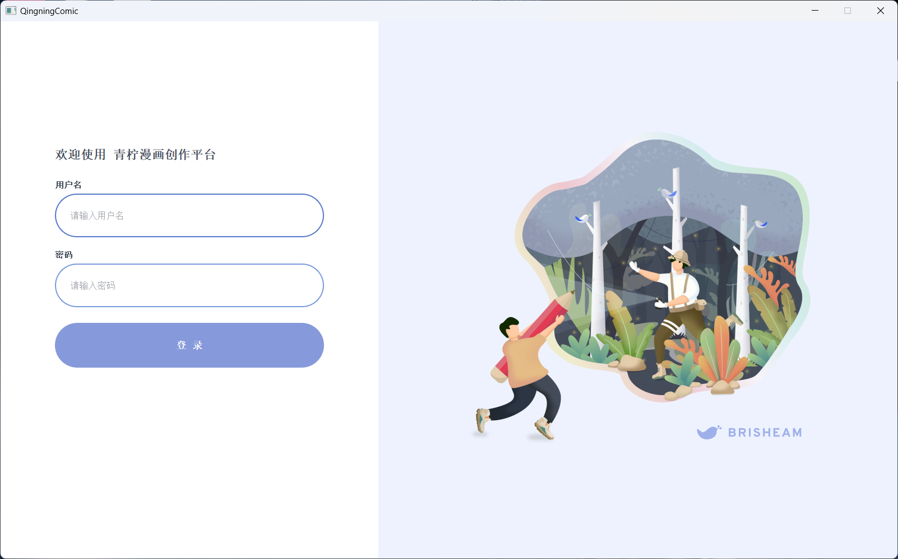
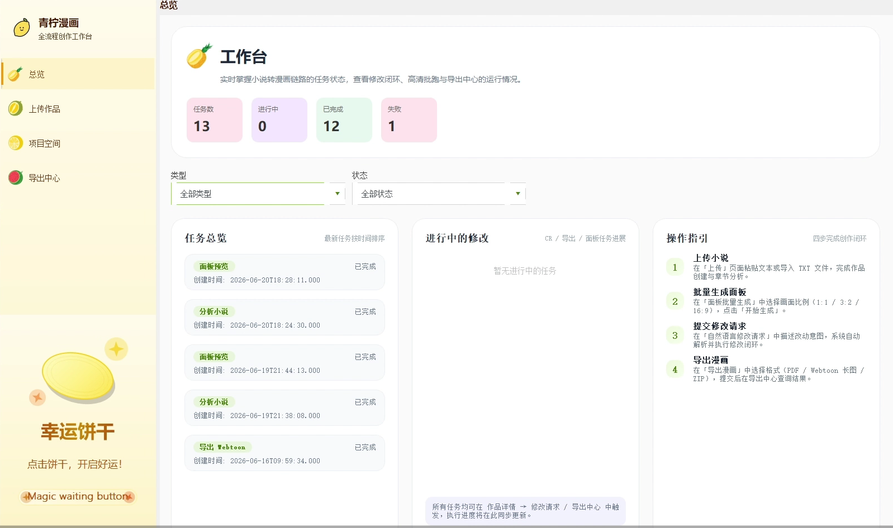
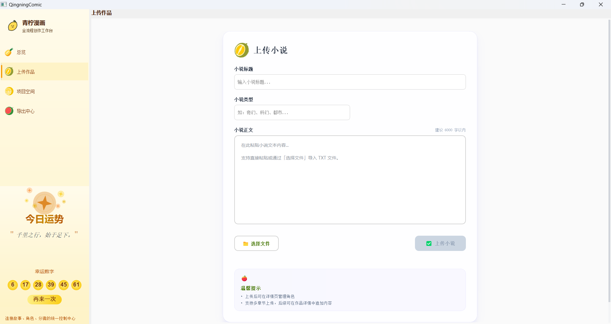
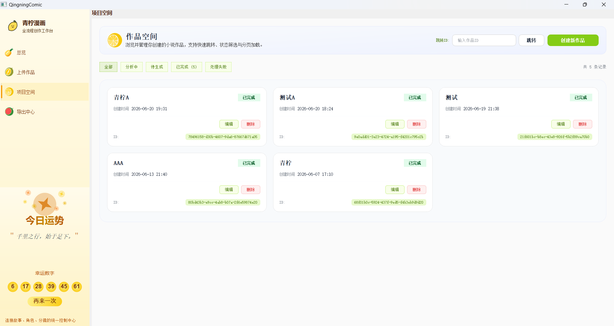
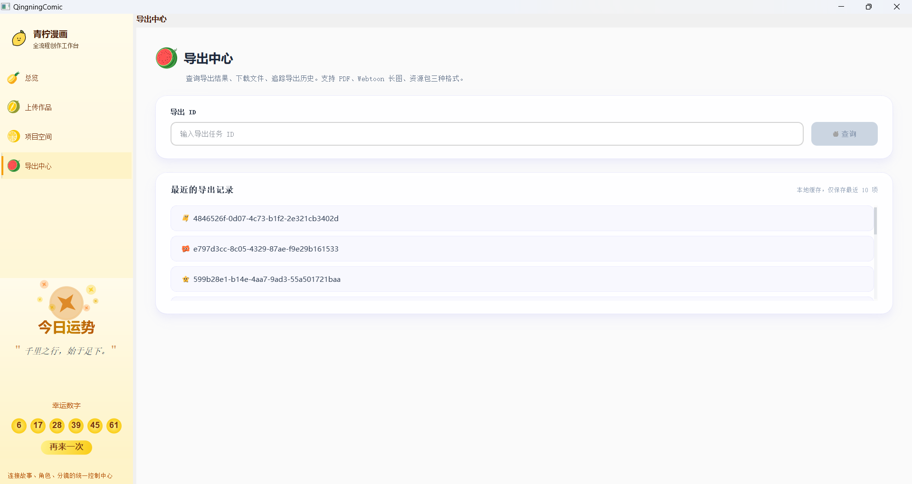
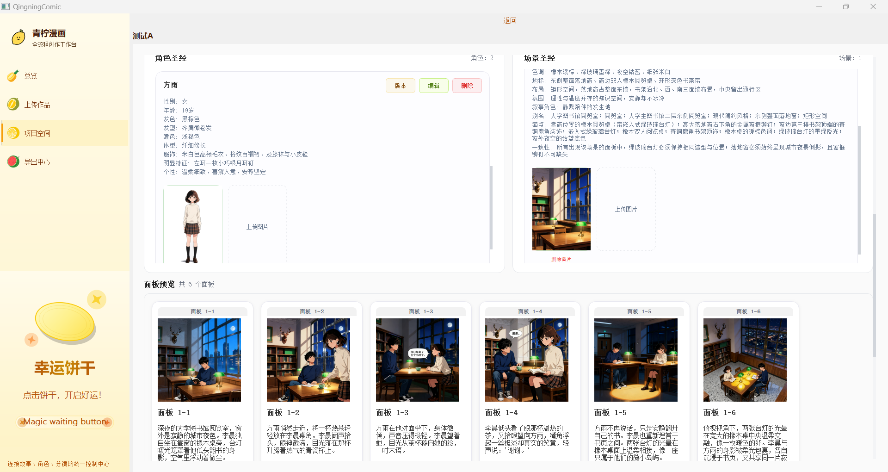
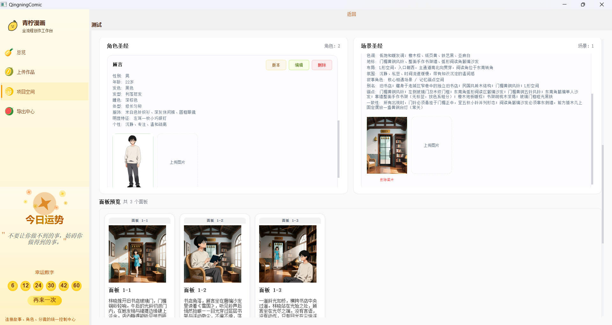
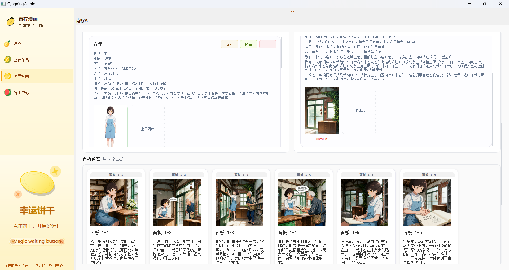
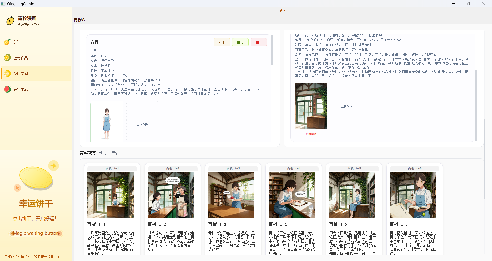

# 青柠漫画

> 从文字到画面，让创意即刻落地

一站式漫画创作平台，输入小说文本，自动输出分镜脚本与漫画面板。基于 C++11 + Qt 5.15.2 实现。

---

## 目标用户

### 漫画创作者

**核心痛点：**

- **角色一致性难维护**：现有 AI 绘图工具每次生成角色长相不一，维护一致性成本极高
- **工具链割裂**：分镜、出图、排版分散在多个工具，缺乏从文字到成品的一体化流程
- **迭代效率低**：想微调某个面板的构图、表情或场景，缺乏精细控制的手段

**解决方案：**

- **角色一致性**：内置角色圣经机制，固定角色外貌描述并自动注入每次生成的 Prompt，无需反复手调
- **一体化流程**：从文字输入、AI 分镜生成、图片生成到 PDF/Webtoon 导出，全程在一个工具内完成
- **自然语言编辑**：对不满意的面板直接用文字描述修改需求，AI 局部重新生成，无需重头操作

**用户故事**：独立漫画创作者小李构思了一个科幻题材的短篇故事。他将 5000 字的剧本输入系统，上传了主角的设定图，8 分钟后得到了 20 页的分镜草稿。发现第 10 页的打斗场面节奏不对，他用自然语言描述了修改需求，2 分钟后得到了新版本。整个流程在一个平台内完成，无需在多个 AI 工具之间反复切换。

---

### 小说读者 / 作者

**核心痛点：**

- **世界观呈现单薄**：纯文字小说缺乏直观的视觉体验
- **人物形象难以统一**：作者难以向读者传达精确的角色形象
- **同人创作门槛高**：喜欢某部作品的读者想创作同人内容，但缺乏绘画技能

**解决方案：**

- **世界观可视化**：为小说生成配套漫画章节，提供具象化的世界观与场景展示
- **角色形象固定**：上传人设图作为参考，AI 生成时保持角色外貌一致
- **同人创作**：撰写同人剧情，上传人设图，生成属于自己的独家同人漫画

**用户故事一**：网文作者小王的奇幻小说在平台上有 10 万读者，她为主要角色绘制了 5 张人设图，但读者反馈"只有几张图还是不够过瘾"。使用本产品后，她将前 3 章（每章约 5000 字）各转换为漫画，每章耗时约 8 分钟。这些漫画作为番外发布后，读者反响热烈，很多读者表示"终于看到书中世界的真实样子了"。

**用户故事二（同人创作）**：动漫粉丝小张非常喜欢某部作品中的两个角色。她用文字写下了一篇 3000 字的同人故事，上传两个角色的官方设定图作为参考，5 分钟后，一部完全属于她自己的 15 页同人漫画诞生了。

---

## 技术挑战

### 漫画对白文字生成

**问题**：AI 图像生成模型在生成可读的中文文字方面表现极差，对白气泡中的文字经常出现乱码、错别字、字体不统一等问题。这是当前 AI 绘图领域的通用性难题，尚无完美解决方案。当前版本中，若直接依赖 AI 生成对白文字，质量不理想。

**解决方案**：

1. **确定位置和内容**：由大模型在文本模态下输出对白的位置坐标和文字内容（JSON 格式）
2. **AI 生成无文字底图**：图像生成时明确要求不生成文字，只画场景和人物
3. **客户端渲染填字**：使用 Qt 图像处理在指定位置以标准字体将对白以气泡形式叠加渲染到图片上

这样可以确保文字 100% 正确、清晰、可读，从根本上规避了 AI 生成文字不可靠的问题。

---

### 跨画面 / 章节的一致性维护

**问题**：AI 图像生成天然具有随机性，同一提示词多次生成结果可能差异巨大。长篇作品中角色可能出现数百次，如何确保"第 1 页的主角"和"第 50 页的主角"是同一个人？场景、服装、道具的细节也需要保持连贯。

**解决方案 — 圣经系统：**

- **角色圣经**：记录角色的详细外貌特征（发色、发型、眼色、服装、体型等），作为生成时的约束条件自动注入 Prompt
- **场景圣经**：记录场景的布局、光线、氛围、关键物品，确保场景前后视觉一致
- **跨任务复用**：圣经内容持久化存储，可在多个生成任务间持续使用和累积
- **变体支持**：同一角色可创建多套外观配置，用户在生成前手动选择使用哪个版本
- **参考图注入**：支持上传人设图作为参考，AI 生成时以此为基准保持角色外貌一致

---

## 功能

- 小说管理（上传、编辑、删除）
- AI 文本分析与分镜脚本生成（Qwen API）
- 角色圣经管理（角色一致性维护）
- 漫画面板图片生成（火山引擎即梦 AI）
- 图片编辑与调整
- 导出（PDF / Webtoon / 资源包）

---

## 演示

[点击观看演示视频（B 站）](https://www.bilibili.com/video/BV1mdj16JEtR)

---

## 截图



















## 技术栈

| 组件 | 选型 |
|------|------|
| 语言 | C++11 |
| GUI | Qt 5.15.2 |
| 数据库 | MySQL 8.0 |
| AI 文本 | 阿里云 Qwen（qwen-plus）|
| AI 图像生成 | 火山引擎即梦 AI（文生图 / 即梦 AI 4.0）|
| AI 图像编辑 | 阿里云 Qwen（qwen-image-edit-plus）|

---

## 架构

```
UI 层 (Qt Widgets)
    │
ViewModel 层
    │
服务层 (NovelService / StoryboardService / ImageService / ...)
    │
API 客户端层 (QwenClient / VolcEngineImageClient)
    │
数据层 (DatabaseManager / FileStorage)
```

---

## 项目结构

```
comic/
├── include/                      # 头文件
├── src/
│   ├── api/                      # API 客户端
│   │   ├── QwenClient            # Qwen 文本分析，支持流式 SSE
│   │   ├── VolcEngineImageClient # 火山引擎即梦 AI 图像生成
│   │   ├── QwenPromptBuilder     # Prompt 构建与管理
│   │   ├── QwenStreamHandler     # SSE 流式响应处理
│   │   └── QwenStoryboardMerger  # 分镜结果合并
│   ├── app/                      # 应用入口与初始化
│   ├── components/               # 可复用 UI 组件
│   │   ├── PanelCard             # 面板卡片（图片+编辑操作）
│   │   ├── BibleSectionWidget    # 角色圣经章节展示
│   │   ├── AnalysisProgressWidget # AI 分析进度展示
│   │   ├── AnalysisResultWidget  # 分析结果展示
│   │   ├── ChapterCard           # 章节卡片
│   │   ├── StoryboardItem        # 分镜列表项
│   │   └── ...
│   ├── pages/                    # 页面
│   │   ├── LoginPage             # 登录页
│   │   ├── DashboardPage         # 主页/仪表盘
│   │   ├── NovelPage             # 小说列表页
│   │   ├── NovelDetailPage       # 小说详情与分镜编辑页
│   │   ├── CharacterDetailPage   # 角色详情与圣经管理页
│   │   └── ExportPage            # 导出页
│   ├── services/                 # 业务服务层
│   │   ├── NovelService          # 小说 CRUD
│   │   ├── StoryboardService     # 分镜 CRUD
│   │   ├── AnalysisService       # 小说 AI 分析
│   │   ├── BibleGenerator        # 角色圣经生成
│   │   ├── BibleImageService     # 圣经角色图片生成
│   │   ├── ImageService          # 面板图片生成与管理
│   │   ├── ExportService         # 导出（PDF/Webtoon/资源包）
│   │   ├── ChangeRequestService  # 自然语言编辑请求处理
│   │   ├── TaskQueue             # 异步任务队列
│   │   └── ServiceContainer      # 服务依赖注入容器
│   ├── viewmodels/               # ViewModel
│   │   ├── NovelViewModel        # 小说列表状态管理
│   │   └── StoryboardViewModel   # 分镜编辑状态管理
│   ├── models/                   # 数据模型
│   │   ├── Novel                 # 小说
│   │   ├── Character             # 角色
│   │   ├── Storyboard            # 分镜
│   │   ├── Panel                 # 面板
│   │   ├── Bible                 # 角色圣经
│   │   ├── Scene                 # 场景
│   │   ├── Job                   # 后台任务
│   │   ├── Task                  # 异步任务
│   │   └── ChangeRequest         # 编辑请求
│   ├── data/                     # 数据层
│   │   ├── DatabaseManager       # MySQL 数据库操作封装
│   │   ├── DatabaseWorker        # 数据库异步工作线程
│   │   ├── FileStorage           # 本地文件存储
│   │   └── SqlBuilder            # SQL 构建器
│   └── utils/                    # 工具类
│       ├── AppConfig             # 配置文件读取
│       ├── Logger                # 日志工具
│       ├── ExportRenderer        # 导出渲染器
│       ├── ExportUtils           # 导出工具函数
│       ├── ImageColorUtils       # 图片颜色处理
│       ├── ImageBorderTrimmer    # 图片边框裁剪
│       ├── BackgroundWhitener    # 背景白化处理
│       ├── BibleCache            # 圣经数据缓存
│       ├── ChangeRequestIntentUtils  # 编辑意图识别
│       └── AsyncImageLoader      # 异步图片加载
├── sql/                          # 数据库建表与迁移脚本
└── resources/                    # 图标、样式等静态资源
```
